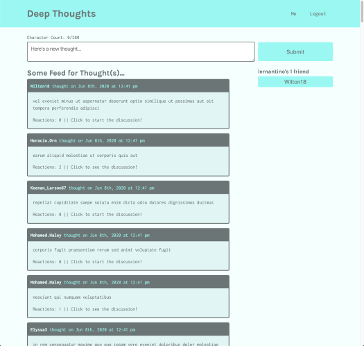

# Deep Thoughts

 

## Description 
A social media application called "Deep Thoughts," where users can create an account, post their thoughts for others to see, and interact with other users through these thoughts. 

## Technologies
- MongoDb
- Express.js
- React
- Node
- React Router
- GraphQl
- Apollo GraphQl
- JWT
## Deployment
[Click here to go to app hosted by heroku](https://peaceful-peak-83039.herokuapp.com/)

## License
[MIT License](https://choosealicense.com/licenses/mit/)

## Questions
  My Github Profile: [michaelwwalker42](https://github.com/michaelwwalker42)  
  For additional questions email me at michaelwwalker42@gmail.com

